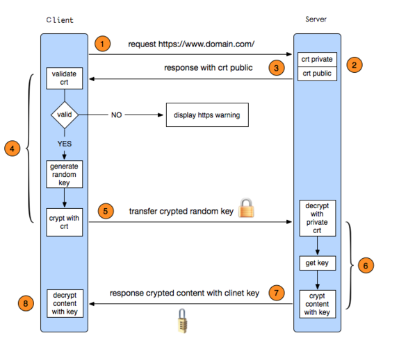

##1.前言（一个安全的APP）
        APP的安全是每一个移动开发者必须面对的问题，而由于iOS平台的封闭性，遭遇到的安
    全问题相比于Android来说要少的多，但是除了系统安全之外，网络安全、数据安全等，也
    是很重要的。而iOS客户端中HTTPS的出现，为我们的网络安全解决了以重大难题。
##2.HTTPS
        HTTPS（全称Hyper Text Transfer Protocol over Secure Socket Layer），是以安全
    为目标的HTTP通道，简单讲是HTTP的安全版。即HTTP下加入SSL层，HTTPS的基础是SSL，因此
    加密的详细内容就需要SSL。
        其实HTTPS从最终数据解析的角度，与HTTP没有任何的区别，HTTPS就是讲HTTP协议数据
    包放到SSL/TSL层加密后，在TCP/IP层醉成IP数据去传输，以此保证传输数据的安全；而对
    于接收端，在SSL/TSL将接受的数据包解密之后，将数据传给HTTP协议层，就是浦东的HTTP
    数据。HTTP和SSL/TSL都处于OSI模型的应用层。从HTTP切换到HTTPS时一个非常简单的过程。
##3.HTTPS的握手过程

        ① 客户端发起HTTPS请求；
        ② 服务端的配置：采用HTTPS协议的服务器必须要有一套数字证书，可以是自己制作或者
    CA证书。区别就是自己颁发的证书需要客户端验证通过，才可以访问；而使用CA证书则不会
    弹出提示页面。这套证书就是一对公钥和私钥，公钥给别人加密使用，私钥给自己解密使用；
        ③ 传送证书：这个证书就是公钥，包含了很多信息，如证书颁发机构，过期时间等；
        ④ 客户端解析证书：这部分工作是由客户端的TLS来完成的，首先会检查公钥是否有效，
    比如颁发机构，过期时间等，如果发现异常，则会弹出一个警告框，提示证书存在问题。如
    果没有问题，那么就生成一个随机值，然后用证书对该值进行加密；
        ⑤ 传送加密信息：这部分传送的是用证书加密后的随机值，目的是让服务端得到这个随
    机值，以后客户端和服务端的通信就通过这个随机值来进行加密解密了。
        ⑥ 服务端解密信息：服务端用私钥几面之后，得到了客户端闯过来的随机值，然后把内
    容通过该值对信息进行对称加密；
        ⑦ 传输加密后的信息：这部分信息是服务端用私钥加密后的信息，可以在客户端被还原；
        ⑧ 客户端解密信息：客户端用之前生成的私钥界面服务端传过来的信息，获得解密后的
    内容。
    ps：对称加密：所谓对称加密就是，将信息和私钥通过某种算法混合在一起，这样除非知道
    私钥，不然无法获取内容，而正好客户端都这道这个私钥，所以只要加密算法够强，私钥够
    复杂，数据就够安全。
##4.HTTPS与HTTP的区别
        ① HTTPS协议需要到CA申请证书或自制证书；
        ② HTTP的信息是明文传输，HTTPS则具有安全性的SSL加密
        ③ HTTP是直接与TCP进行数据传输，而HTTPS则是经过一层SSL（OSI表示层）；
        ④ HTTP用的端口是80，而HTTPS是443；
        ⑤ HTTP的连接是简单的，无状态的；HTTPS协议是由SSL+HTTP协议构建的可进行加密传输
    、身份验证的网络协议，比HTTP协议安全。
 
        
    
