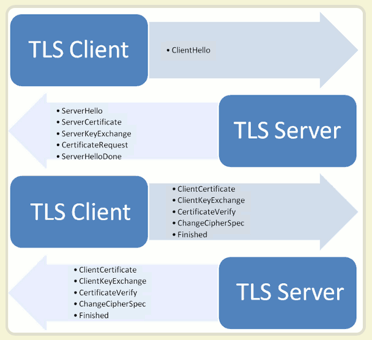
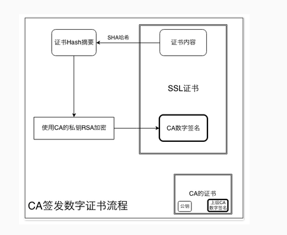

#SSL介绍
##1.SSL的作用
        不使用SSL/TSL的HTTP通信，就是不加密的通信，所有信息明文传播，带来了三大
    风险：
        ① 窃听风险：第三方可以获知通信内容；
        ② 篡改风险：第三方可以修改通信内容；
        ③ 冒充风向：第三方可以冒充他人身份参与通信；
        SSL/TSL协议是为了解决这三大风险而设计的，希望达到：
        ① 所有信息都是加密传播，第三方无法窃听；
        ② 具有校验机制，一旦被篡改，通信双方离开会发现；
        ③ 配备身份证书，防止身份被冒充；
        互联网是开放环境，通信双方都是未知身份，这为协议设计带来了很大的难度，而且
    协议还必须能够经受的住所有的攻击，这使得SSL/TSL协议变得非常复杂；
##2.SSL的历史
        ① 1994年，NetScape公司设计了SSL协议的1.0版，但是未发布；
        ② 1995年，NetScape公司发布了SSL2.0版，很快发现有验证漏洞；
        ③ 1996年，SSL 3.0问世，得到大规模应用；
        ④ 1999年，互联网标准化组织ISOC接替了NetScape公司，发不了SSL的升级TLS1.0版；
        ⑤ 2006年和2008年，TLS进行了两次升级，分别为TlsLS1.1和TLS1.2版；
        ⑥ 最新的变动是2011年TLS1.2的修订版；
        目前，应用最广泛的是TLS1.0，接下来是SSL3.0 。但是主流的浏览器已经实现了TLS1.2；
        TLS1.0通常被标示为SSL3.1，TLS1.1为SSL3.2，TLS1.2为SSL2.2。
##3.基本运行过程
        SSL/TSL协议的基本思路是采用公钥加密法，也就是说客户端想服务器端索要公钥，然后
    用公钥加密信息，服务器端收到密文后，用自己的私钥解密；SSL/TSL的协议的基本过程如下：
        ① 客户端向服务器端索要并验证公钥；
        ② 双方协商生成“对话秘钥”；
        ③ 双方采用“对话秘钥”进行加密通信。
        上面过程的前两步，又称为“握手阶段”。
        ps：① 保证公钥不被篡改：将公钥放在数字证书中，只要证书是可信的，公钥就是可信的。
            ② 减少公钥加密计算的时间：每一次对话，客户端和服务器端都生成一个“对话秘钥”，
        用它来加密信息，由于对话秘钥是对称加密，所以运算速度非常快，而服务器端只用于对
        话秘钥本身，这样就减少了加密运算的消耗时间。
##4.握手的详细过程

        ① 客户端发出请求：
            首先，客户端想服务器发出加密通信得到请求，这被叫做ClientHello请求；
            这一步，客户端主要想服务器端提供一下信息：
            A.支持的协议版本，比如TLS 1.0版；
            B.一个客户端生成的随机数，稍后用于生成“对话秘钥”；
            C.支持的加密方法，比如RSA公钥加密；
            D.支持的压缩方法；
        ② 服务器回应：
            服务器收到客户端请求后，想客户端发出回应，这叫做ServerHello；
            这一步，服务器的回应包含以下内容：
            A.确认使用的加密通信协议版本，例如TLS 1.0版，如果客户端与服务器支持的版本不
        一致，服务器关闭加密通信；
            B.一个服务器生成的随机数，稍后用于生成“对话秘钥”；
            C.确认使用的加密方法，比如RSA公钥加密；
            D.服务器证书；
        ③ 客户端回应：
            客户端收到服务器的回应后，首先验证服务器证书，如果证书不是可信机构颁布、或者
        证书的域名与实际域名不一致，或者证书已经过期，就会想访问者显示一个警告，由其选择
        是否继续通信；
            如果证书没有问题，客户端就会从证书中取出服务器的公钥，然后想服务器发送一下信
        息：
            A.一个随机数，该随机数用服务器公钥加密，放着被窃听；
            B.编码改变通知，表示随后的信息都讲用于双方商定的加密方法和秘钥发送；
            C.客户端握手结束通知，表示客户端的握手阶段已经结束，这一项同时也是前面发送的所
        有内容的hash值，用来供服务器检验。
            上面的随机数，是整个握手阶段出现的第三个随机数，又称“pre-master key”，有了它，
        客户端和服务器端就同时有了三个随机数，接着双方就用事先商定的加密方法，各自生成本次
        对话所有的同一把“对话秘钥”；
        ④ 服务器端的最后回应：
            服务器端收到客户端的第三个随机数pre-master key之后，计算本次对话所用的“对话秘钥”，
        然后，想客户端最后发送下面信息：
            A.编码改变通知，表示随后的信息都将用双方商定的加密方法和秘钥发送；
            B.服务器握手结束通知，表示服务器的握手阶段已经结束，这一项同时也是签名发送的所有
        内容的hash值，用来供客户端检验；
        
        至此，整个握手阶段结束，接下来，客户端与服务器端进入加密通信，就完全是使用普通的HTTP
    协议，只不过用“对话秘钥”加密内容。
##5.SSL/TSL总结
        简单来说，SSL/TSL通过四次握手，主要交换了三个信息：
        ① 数字证书：该证书包含了公钥等信息，一般有服务器发送给客户端，而客户端需要对证书进行
    验证；
        ② 三个随机数：这三个随机数构成了后续通信过程中用来对数据进行对称加密解密的“对称秘钥”；
        ④ 加密通信协议：就是双方商量使用哪一种加密方式，假如双方支持的加密方式不匹配，则无法
    进行通信；
        ps：随机数为什么用三个？
            这是由于SSL/TSL设计，假设服务器不相信所有的客户端都能够提供完全随机数，假如某个客户
        端提供的随机数不随机的话，就大大增加了“对话秘钥”被破解的风险，所以由三组随机数组成的最后
        随机数，保证了随机数的随机性，以此保证每次生成的“对话秘钥”安全性。
##6.数字证书简介
        数字证书是一个电子文档，其中包含了持有者的信息、公钥以及证明该证书有效的数字签名，而
    数字证书以及相关的公钥管理和验证技术组成了PKI（公钥基础设施）规范体系。一般来说，数字证书
    认证机构（Certificate authority，即CA）来负责签发和管理，并承担PKI体系中公钥合法性的检验
    责任；数字证书的类型有很多，而HTTPS使用的就是SSL证书。
##7.CA的组织结构
        CA的组织结构中，最顶层的是根CA，根CA呷可以授权给多个二级CA，而二级CA又可以授权给多个三
    级CA，所以CA得组织结构是一个树结构，对于SSL证书市场来说，主要被Symantec（旗下有Versign和
    GeoTrust）、Comodo SSL、Go Daddy和GlobalSign瓜分。
##8.数字证书的签发流程

        数字证书的签发机构CA，在接收到申请者的资料后，进行核对并确定信息的真实有效，然后就会制
    作一份符合X.509标准的文件，证书中的证书内容包括了持有者信息和公钥都是由申请者提供的，而数
    字签名则是CA机构对证书内容进行hash加密后得到的，而这个数字签名就是我们验证证书是否是由可信
    CA签发的数据。
##9.证书验证的流程

    
        接收端街道一份数字证书Cer1后，对证书的内容做Hash得到H1；然后在签发该证书的机构CA1的数字
    证书中找到公钥，对证书上数字签名进行解密，得到证书Cer1签名的Hash摘要H2；对比H1和H2，加入相等
    ，则表示证书没有被篡改。但这个时候还是不知道CA是否是合法的，我们看到上图中有CA机构的数字证书
    ，这个证书是公开的，所有人都可以获取到，而这个证书中的数字签名是上一级生成的，所以可以这样一
    直递归下去，直到根CA。根CA是自验证的，即他的数字签名是由自己的私钥来生成的。合法的根CA会被浏
    览器和操作系统加入到权威CA列表中，这样就完成了最终的验证。所以，一定要保护好自己环境（浏览器
    /操作系统）中根CA信任列表，信任了根CA就表示信任所有根CA下所以子级CA所签发的证书，不要随便添加
    根CA证书。
    
